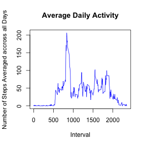
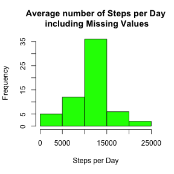

&nbsp;
&nbsp;
&nbsp;

## Data

The data for this assignment can be downloaded from the course web site:  
Dataset: [Activity monitoring data](https://d396qusza40orc.cloudfront.net/repdata%2Fdata%2Factivity.zip) [52K]
The variables included in this dataset are:

* steps: Number of steps taking in a 5-minute interval (missing values are coded as NA)
* date: The date on which the measurement was taken in YYYY-MM-DD format
* interval: Identifier for the 5-minute interval in which measurement was taken

The dataset is stored in a comma-separated-value (CSV) file and there are a total of 17,568 observations in this dataset.

&nbsp;
&nbsp;
&nbsp;

## Loading and preprocessing the data

&nbsp;

**1. Load the data**  
**2. Process/transform the data (if necessary) into a format suitable for your analysis**

&nbsp;

We first here load the data after downloading it from the web link that has been provided (see the link above in this document).

```r
data <- read.csv("activity.csv", sep=",", header = TRUE, stringsAsFactors = FALSE, na.strings = "NA")
```
So here we download the zip file and load the extracted file using `read.csv()`.

&nbsp;
&nbsp;
&nbsp;
    
## What is mean total number of steps taken per day?

&nbsp;

**For this part of the assignment, you can ignore the missing values in the dataset.**

**1. Calculate the total number of steps taken per day**

&nbsp;
We are going tu use the `complete.cases`function to extract all the `NA`values from the dataset. Then, we calculate the sum of steps (total number) for each day by applying the `tapply`function with steps and date, calling the function `sum`.

```r
data_n <- data[complete.cases(data),]
tot_step_day <- tapply(data_n$steps, data_n$date, sum, na.rm = TRUE)
```

&nbsp;

**2. If you do not understand the difference between a histogram and a barplot, research the difference between them. Make a histogram of the total number of steps taken each day**

&nbsp;
We are now plotting the histogram that shows us the steps and their frequency.

```r
hist(tot_step_day, col="blue", xlab = "Steps per Day", main = "Number of Steps per Day")
```

 

&nbsp;

*Notice that if we hadn't extracted the `NA`values from the initial dataset (see above), we would have a slightly different histogram here, with a larger 0 frequency of steps because the `tot_step_day`array would have contained 0 frequency steps instead of `NA`. Furthermore, the mean that we are about to calculate would have been different too.*
&nbsp;

**3. Calculate and report the mean and median of the total number of steps taken per day**

&nbsp;
We now calculate the mean and median by simply applying the functions `mean`and `median`.

```r
mean_tot <- mean(tot_step_day)
median_tot <- median(tot_step_day)
```

```r
mean_tot
```

```
## [1] 10766.19
```

```r
median_tot
```

```
## [1] 10765
```
So, as we can see above, the mean is 10766 and the median is 10765.

&nbsp;
&nbsp;
&nbsp;

## What is the average daily activity pattern?

&nbsp;

**1. Make a time series plot (i.e. `type = "l"`) of the 5-minute interval (x-axis) and the average number of steps taken, averaged across all days (y-axis)**

&nbsp;
Here, we are building the time series the same way that we did before, using `tapply`, but this time with the variables `steps`and ìnterval`and a call to the `mean`function.

```r
data_n <- data[complete.cases(data),]
time_series <- tapply(data_n$steps, data_n$interval, mean, na.rm = TRUE)
```
We plot the time series by assigning the names of the time series (the 5-minute intervals) to the x-axis, and the values (averaged steps) to the y-axis.

```r
plot(names(time_series), time_series, type = "l", xlab = "Interval", ylab = "Number of Steps Averaged accross all Days", main = "Average Daily Activity", col = "blue")
```

 

&nbsp;

**2. Which 5-minute interval, on average across all the days in the dataset, contains the maximum number of steps?**

&nbsp;
To find the maximum value, we use the `which.max`function that gives us the maximum value for the time series. And then, we apply this index to the names of the time series to get the corresponding 5-minute interval.

```r
a <- which.max(time_series)
names(a)
```

```
## [1] "835"
```
The 5-minute interval that contains the maximum number of steps is 835.

&nbsp;
&nbsp;
&nbsp;
 
## Imputing missing values

&nbsp;

**Note that there are a number of days/intervals where there are missing values (coded as NA). The presence of missing days may introduce bias into some calculations or summaries of the data.**

**1. Calculate and report the total number of missing values in the dataset (i.e. the total number of rows with NAs)**

&nbsp;
We use the `complete.cases`function to extract the `NA`values from the dataset and so use it to calculate the number of rows concerned.

```r
num_na <- sum(!(complete.cases(data)))
num_na
```

```
## [1] 2304
```
The total number of missing values in the dataset is 2304.

&nbsp;

**2. Devise a strategy for filling in all of the missing values in the dataset. The strategy does not need to be sophisticated. For example, you could use the mean/median for that day, or the mean for that 5-minute interval, etc.**  
and  
**3. Create a new dataset that is equal to the original dataset but with the missing data filled in.**

&nbsp;

Here we are going to assign to each `NA` value the average number of steps calculated through all the other steps values for the same interval for all days. We are creating the new dataset at the same time within the for-loop call.

```r
data_new <- data
for (i in 1:nrow(data_new)){
    if (is.na(data_new$steps[i])){
        data_new$steps[i] <- mean(data_new$steps[data_new$interval == data_new$interval[i]], na.rm=TRUE)
    }
}
```

&nbsp;

**4. Make a histogram of the total number of steps taken each day and Calculate and report the mean and median total number of steps taken per day. Do these values differ from the estimates from the first part of the assignment? What is the impact of imputing missing data on the estimates of the total daily number of steps?**

&nbsp;
We use the same method as above in this document to plot the histogram.

```r
tot_step_day2 <- tapply(data_new$steps, data_new$date, sum)
hist(tot_step_day2, col = "green",xlab = "Steps per Day", main = "Average number of Steps per Day\n including Missing Values")
```

 

&nbsp;
&nbsp;

And now we calculate the mean and the median of this set.

```r
mean_tot2 <- mean(tot_step_day2)
median_tot2 <- median(tot_step_day2)
```
We now print these values.

```r
mean_tot2
```

```
## [1] 10766.19
```

```r
median_tot2
```

```
## [1] 10766.19
```
We can see that these values are very close to the estimates from the first part of the assignment. This is due to the fact that we have replaced the `NA`values with the mean of the set for the other days.
Let's calculate the difference to see that these values are very close.

```r
mean_tot2 - mean_tot
```

```
## [1] 0
```

```r
median_tot2 - median_tot
```

```
## [1] 1.188679
```

&nbsp;
&nbsp;
&nbsp;
 
## Are there differences in activity patterns between weekdays and weekends?

&nbsp;

**For this part the `weekdays()` function may be of some help here. Use the dataset with the filled-in missing values for this part.**

**1. Create a new factor variable in the dataset with two levels – “weekday” and “weekend” indicating whether a given date is a weekday or weekend day.**

&nbsp;

Here we create the new factor variable by checking if the weekday of the date value is a Saturady/Sunday or another weekday. We assign the test value (`weekday`/`weekend`) to the variable `w` and then we create this variable inside the dataset and set it to factor.

```r
w <- weekdays(strptime(data_new$date, format = "%Y-%m-%d"))
for (i in 1:length(w)){
    if (w[i] == "Saturday" | w[i] == "Sunday"){
        w[i] <- "weekend"
    } 
    else {
        w[i] <- "weekday"
    }
}
w <- as.factor(w)
data_new$w <- w
```

&nbsp;

**2. Make a panel plot containing a time series plot (i.e. type = "l") of the 5-minute interval (x-axis) and the average number of steps taken, averaged across all weekday days or weekend days (y-axis). See the README file in the GitHub repository to see an example of what this plot should look like using simulated data.**

&nbsp;
To be able to make the plot, we use the function aggregate to create a new dataset in which we have the steps, the intervals, and the factor variable weekday/weekend. It enables to make the plot with the condition on the `w` variable (weekday/weekend).

```r
data_fin <- aggregate(steps ~ interval + w, data = data_new, mean)

library(lattice)

xyplot(steps ~ interval | w, data = data_fin, type = "l", layout = c(1, 2), xlab = "Interval", ylab = "Number of Steps")
```

 
